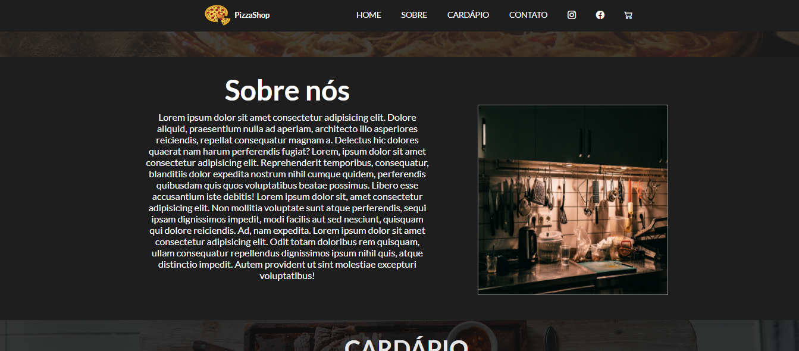
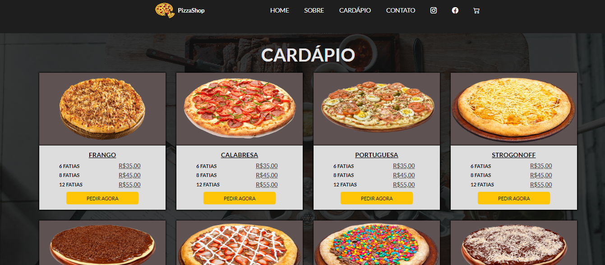
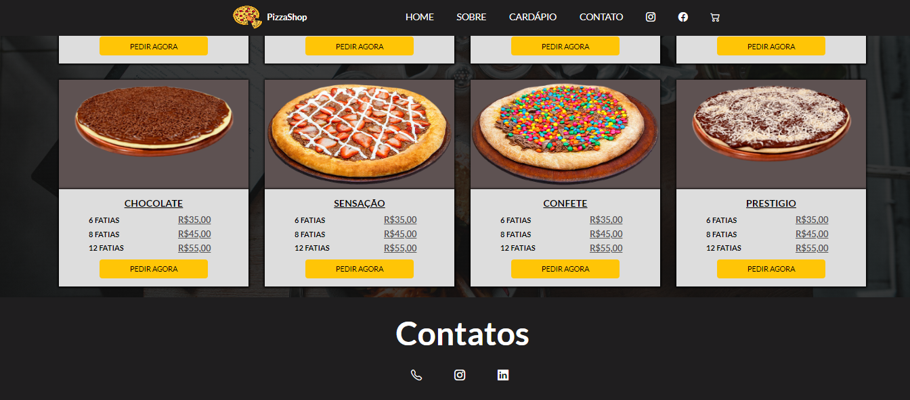

# Site Fictício de uma Pizzaria 

## Sobre
O projeto é um site fictício para uma pizzaria, projetado para proporcionar uma experiência gastronômica envolvente e atrativa aos visitantes. Com um design apetitoso e funcionalidades interativas, o site oferece um cardápio variado com uma ampla seleção de sabores de pizzas. 

## Recursos Principais:

* Cardápio Interativo de Pizzas: O site apresenta um cardápio completo com uma variedade de sabores de pizzas. Os visitantes podem explorar os diferentes sabores disponíveis e imagens atraentes de cada pizza.

* Design Atraente e Responsivo: O site é projetado com um layout visualmente atraente e responsivo, garantindo uma experiência consistente e agradável em uma variedade de dispositivos, desde desktops até smartphones. Elementos de design cuidadosamente selecionados, como cores vibrantes e imagens apetitosas, contribuem para criar uma atmosfera convidativa e apetitosa.

## Tecnologias Utilizadas:

*  
* 
* 

## Contribuição

* Contribuições são bem-vindas, sinta-se à vontade para Clonar o repositório ou enviar Pull requests.

## Website 🌐 ➡️  https://danielolivermoco.github.io/site-pizzaria/

